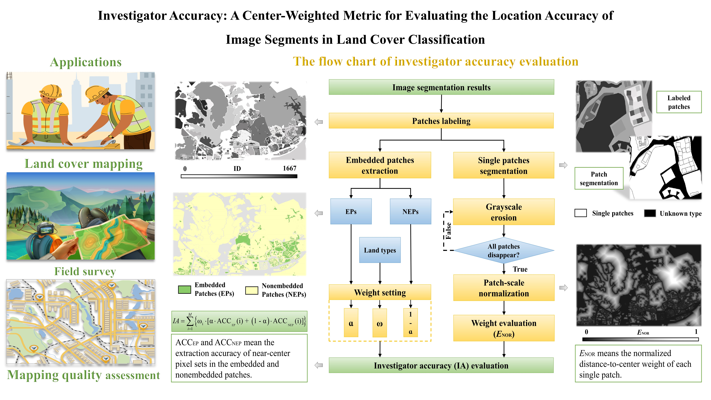

# Investigator-accuracy
## A center-weighted metric for evaluating the location accuracy of image segments in land cover classification

Accuracy evaluation is an essential step in validating image segmentation results. Existing metrics, such as overall accuracy and F1-score, mainly concern the range and consistency of the semantic labels of image segments, which may not be sufficiently sensitive to detect missing or segmentation errors in small patches. To address this issue, this study proposes the investigator accuracy (IA) metric, which focuses on the location accuracy of single patches by evaluating the capture accuracy of their near-center subregions and category weight to determine the image segmentation quality. Before evaluating the IA metric, we optimize the grayscale dilation algorithm to separate each identified patch from the image without converting the data format and then distinguish each patch as embedded or nonembedded. Next, we use an iterative grayscale erosion approach to assess the distance-to-center weight, which is a crucial parameter for evaluating the IA of each pixel in a single patch. In addition, we apply a parallel analysis scheme to improve the efficiency of the IA evaluation. The results indicate that the capture accuracy of near-center subregions and the category weight of a single patch affect its IA. Unlike commonly used metrics, the IA is independent of the area ratio and the number of patches belonging to multiple land cover types.

###  We provided the Python script for the IA assessment in the Script directory and a sample dataset within the test directory. 
The flowchart and applications of the IA metric are shown below:

### Please note that the embedded and non-embedded patches separation should perform on the reference image, not the image segmentation results. 
What are embedded and non-embedded patches? Seen the following figure  :)

### Owing to the circumcenter, incenter, and centroid points extracted from various single patches that cannot locate a single patch robustly, it is also applicable to use the ENOR layer to find the near-center subregion of each patch. The patch-scale ENOR calculation method is shown in the IA assessment algorithm.

###If you have any issues during the IA calculation, do not hesitate to contact me by email (wbx19911026@outlook.com) or leave a message under this project.

